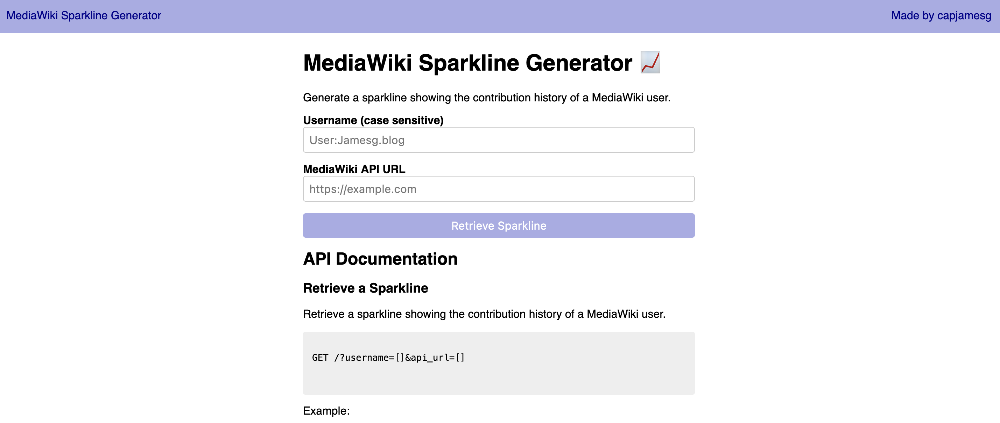

# MediaWiki Sparkline Generator

Create a sparkline to visualise your MediaWiki contributions.

## How it Works

This project is a web server that:

1. Retrieves your MediaWiki contributions from the API of your MediaWiki instance.
2. Plots your contributions on a timeline over the last 90 days.
3. Renders an SVG file made by [kryogenix.org](https://kryogenix.org/days/2012/12/30/simple-svg-sparklines/) to plot the contribution numbers on a line chart.

## Using the Service

A hosted version of the sparkline service is available at [sparkline.jamesg.blog](https://sparkline.jamesg.blog).

To retrieve a sparkline, specify the following values:

    https://sparkline.jamesg.blog/?api_url=[string]&username=[string]

`api_url` should be set to the root URL for your MediaWiki API. `username` should be your MediaWiki username.

Please note the `username` attribute is case sensitive.

## Getting Started

First, install the required dependencies for this project. You can do this using the following command:

    bundle install

Next, run the sparkline server:

    ruby sparkline.rb

## Language

This project is built in Ruby.

## License

This project is licensed under an [MIT license](LICENSE).

## Author

- capjamesg