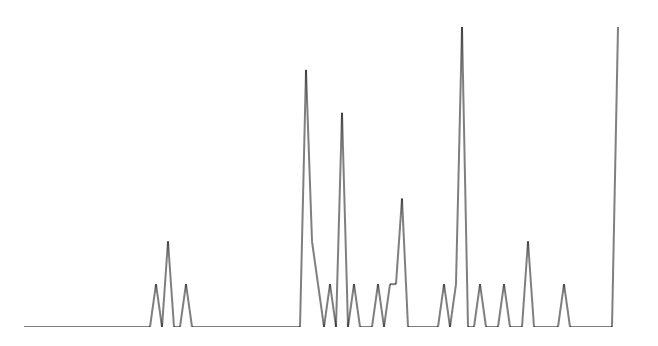

# MediaWiki Sparkline Generator

Create a sparkline to visualise your MediaWiki contributions.

## Screenshots

## How it Works

This project is a web server that:

1. Retrieves your MediaWiki contributions from the API of your MediaWiki instance.
2. Plots your contributions on a timeline over the last 90 days.
3. Renders an SVG file with a sparkline.
    a. The line chart sparkline was made by [kryogenix.org](https://kryogenix.org/days/2012/12/30/simple-svg-sparklines/) (used with permission).
    b. The bar chart sparkline was made by me.

## Using the Service

A hosted version of the sparkline service is available at [sparkline.jamesg.blog](https://sparkline.jamesg.blog).

The root endpoint for the service is:

    https://sparkline.jamesg.blog

The following query string parameters are required:

- `api_url`: The root URL for your MediaWiki API.
- `username`: Your MediaWiki username.

The following values are optional:

- `days`: Number of days in history for which you want to retrieve stats. Min 1. Max 120.
- `only_image`: By default, the API returns a text page with some meta information and the sparkline embedded. Specify an `only_image` value to retrieve only an image.
- `is_bar`: Return a bar chart. This option is experimental.

Please note the `username` attribute is case sensitive.

Here is an example query to the endpoint:

    https://sparkline.jamesg.blog/?username=Jamesg.blog&api_url=https://indieweb.org/wiki/api.php&only_image=true

This query returns a line sparkline graph my IndieWeb wiki contributions. The result is an SVG file.

## Getting Started

First, install the required dependencies for this project. You can do this using the following command:

    bundle install

Next, run the sparkline server:

    ruby sparkline.rb

## Language

This project is built in Ruby.

## License

This project is licensed under an [MIT 0 license](LICENSE).

## Acknowledgements

Thank you to [Stuart Langridge](https://kryogenix.org) for allowing me to use his [simple SVG sparkline](https://kryogenix.org/days/2012/12/30/simple-svg-sparklines/) file for the line graph chart.

## Author

- capjamesg